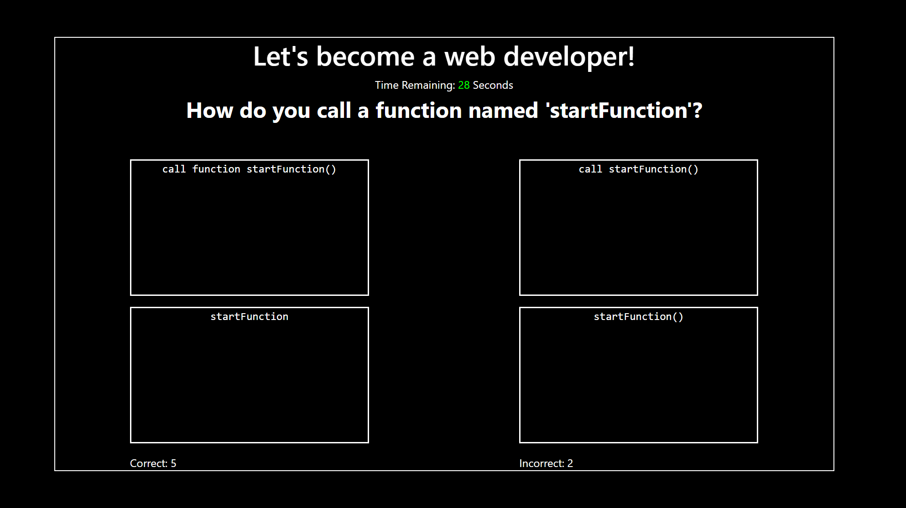
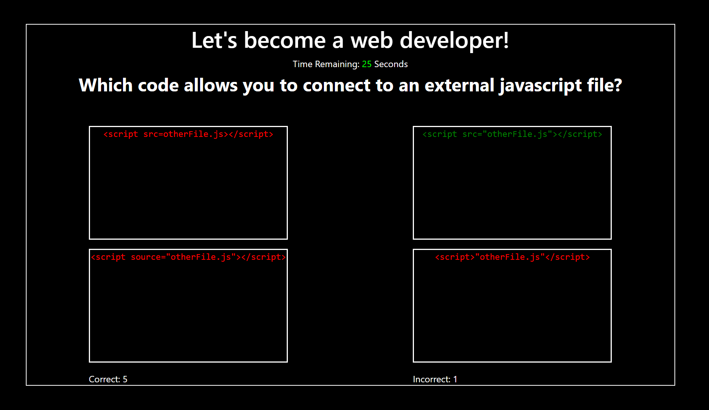

# TriviaGame

## Web Development Quiz
Take the test and see if you're better than the rest! This simple web development game is built to act as a flashcard system to internalize some of the key web development ideas.

## Demo:

Play the game here: https://bradleyknutson.github.io/TriviaGame/

## Frameworks Used:
* jQuery
* Bootstrap
* Vanilla HTML, CSS, Javascript

## Working Improvements:
* Keep track of how many times a specific question has been answered correctly and ask that question less often than the others.
* Add many more questions about topics being discussed in the DU web development bootcamp.
